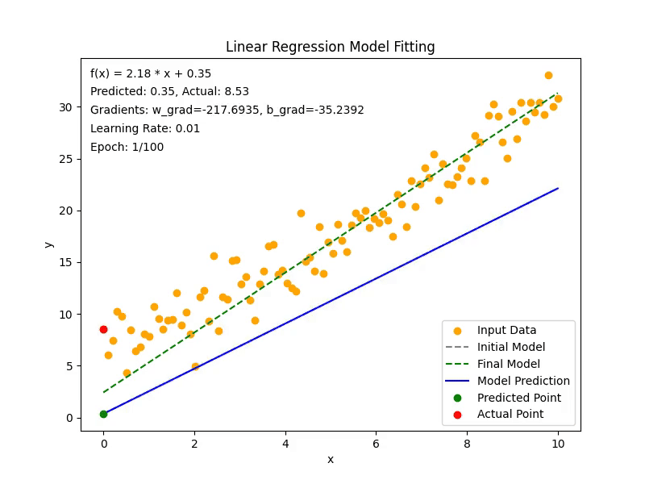

# Linear Regression Visualization with Gradient Descent

This project demonstrates linear regression using gradient descent and visualizes the learning process through animation.  

## demo


## Overview

The code simulates a linear regression model fitting process by minimizing the error between predicted and actual values. It visualizes the following:  
1. The input data points.  
2. Predicted values based on the model at each epoch.  
3. Changes in the regression line as the model parameters (w and b) are updated.  
4. The initial and final regression lines for comparison.  
5. Numerical information such as gradients, learning rates, and errors during the learning process.  

## Requirements

- Python 3.x  
- Matplotlib  
- NumPy  
- FFmpeg (for saving the animation as a video)  

### Installation

```bash
pip install matplotlib numpy
```

## Output
1. Animation file linear_regression_with_predictions_final_lines.mp4 will be generated.
2. Visualization of learning progress with dynamic updates of predicted and actual values.

## Key Components
* Gradient Descent: Updates weights (w) and bias (b) based on the computed gradients.
* Animation: Shows how the regression line and predictions evolve during training.
* Model Formula Display: Displays the formula of the regression line and the current predicted/actual values.

## Explanation
The model attempts to fit a linear equation:

$y(x) = w * x + b$

## Error Calculation:
$Error = y'(x) - y(x)$

* y'(x): Predicted value based on current weights.
* y(x): Observed/actual value.

## Gradient Descent Updates:
Calculate gradients for w and b:

$w_grad = (2 / len(x)) * Σ(error * x)$

$b_grad = (2 / len(x)) * Σ(error)$


## Update parameters:
$w = w - learning_rate * w_grad$

$b = b - learning_rate * b_grad$

### Visualization Details:
* Displays input data as orange points.
* Shows predicted values dynamically as green points.
* Highlights actual values as red points.
* Plots the initial and final regression lines for comparison.

